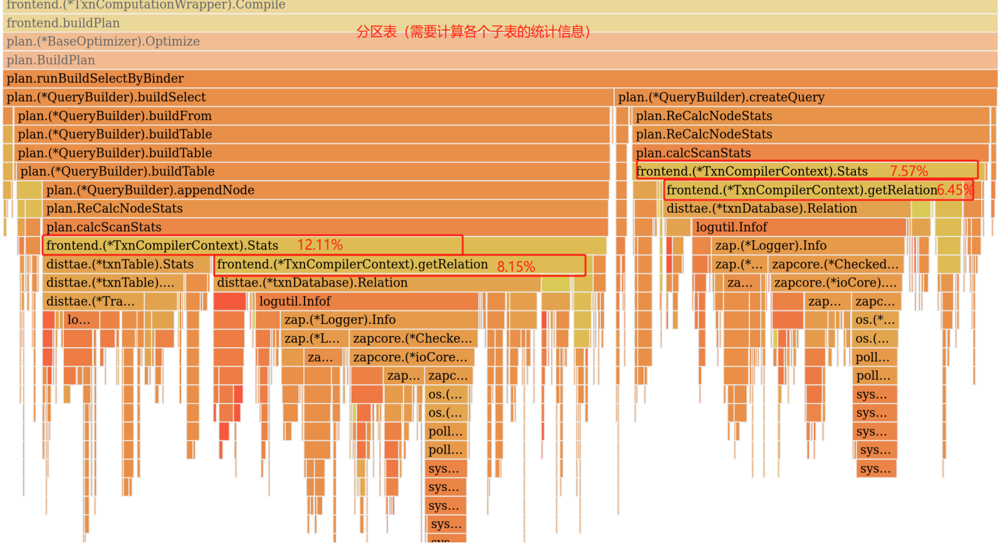

#### 分区表性能调研分析报告

#### 概要：

​		前期进行了分区表和普通表的tpcc功能和性能对比测试，在悲观事务下，发现分区表在查询，insert，delete等方面与普通表存在不同程度的性能差距，现进行分区表的性能分析调研，为下一步进行性能优化进行方案支持

​		文档从**SELECT，INSERT**和**DELTE**三个维度分析和讨论分区表性能瓶颈

#### 一、分区表的查询性能分析

##### 1.1 点查询：

​	**初步结论1**：分区表在buildPlan 和 createQuery（优化执行计划）阶段，都需要对每个分区子表执行calcScanStats（计算统计信息），而calcScanStats当中主要是getRelation消耗，此处消耗占比是普通表的3倍以上， 

[^注]: 对于key分区而言， 点查询的时候， 可以进行分区裁剪，范围查询无法进行分区裁剪

火焰图：

**优化方向：**

​	需要和倪涛讨论和调研一下，

​	1.分区表是否有必要plan.calcScanStats，或者分区表的plan.calcScanStats操作能否只做一次，

​	2. 采用缓存的方式 把分区子表的Stats信息缓存起来

**初步结论2**：

​		分区表相较于普通表有更多的object文件和block块，在读数据时，在BlockRead上消耗的时间是普通表的2倍，并且随着分区数量的增加，object文件和block块随之增加， 分区表性能会呈下降趋势

###### 普通表与分区表在100万行数据时，object和block块对比：

| blocks变化  | 非分区表（100w） | 分区表100分区（100w） |
| ----------- | ---------------- | --------------------- |
| object数量  | 4                | 100                   |
| block块数量 | 115              | 200                   |

**由上图可见：**

​		分区表分区数量越多，产生block块碎片的可能性就越多，相较于普通表会有更多的block块，同时存储时也会有更多的object，一个object对应一个S3文件，更多的object意味着更多次文件IO

**火焰图对比：**

**优化方向：**

​		在分区数量和表数据大小确定的情况下，分区表的block块碎片问题，在存储侧可能无法改变，可以通过分区裁剪的方式进行优化，从而减少系统读取的object和block数量（目前分区裁剪不完整）

- ​	对于key/hash分区**点查询**而言，可以通过分区裁剪的方式进行优化，但可能仍不及同样条件下的普通表性能，
- ​	对于key/hash分区**范围查询**而言，无法使用分区裁剪进行优化

##### 1.2 范围查询：

​	**初步结论：**范围查询筛选的数据量较大，性能差距主要体现在pipeline执行阶段，分区表性能不如普通表，主要因为分区表有更多的object文件和block块，并且无法进行分区裁剪，因此在读数据时，对每个分区子表都有主键过滤操作，在BlockRead上消耗的更多的时间。

​		与点查询相比，在buildPlan时plan.calcScanStats的消耗占比并不明显。

**火焰图对比：**

**优化方向：**

​	对于范围查询而言：

​		key/hash分区无法进行分区裁剪，因此优化效果方法比较有限，范围查询适用分区裁剪的情况是：range分区和range columns分区，目前range分区和range columns分区裁剪尚未开发

​				

#### 二、分区表的insert性能分析

##### 2.1 批量插入（insert into select）

**初步结论：**在执行批量插入时，分区表性能瓶颈主要体现在pipeline上，在lockOp算子有很大性能开销，是普通表的4倍左右，lockOp算子需要对每个分区子表进行加锁，故随着分区数量的增加，insert性能会呈下降趋势

**优化方向：**

​     对于在悲观事务下批量插入而言，lockop算子对分区表性能影响非常大，后面需要张旭侧协助沟通，确定优化策略，目前能想到优化点是：可以对进入lockop算子数据进行按照分区分组，只对命中的分区子表进行加锁，减少加锁的数量

##### 2.2 单值插入（insert into value）

**初步结论：**在单值插入insert语句的执行生命周期中，执行计划构建占据较大比重，分区表需要获取每个分区子表的元数据信息和数学统计信息，相比与普通表该操作占据较大比重，约为普通表的3倍左右，（但是执行单条SQL性能差距几乎可以忽略不计）

**优化方向：**

​		insert数据有可能命中任何一个分区，因此需要获取每个分区子表的元数据信息，但是随着分区数量的增加，获取每个分区子表的元数据信息和Stats开销会逐渐增加，如果insert into value非常密集，性能自然下降，建议采用缓存机制将分区子表的元数据信息下来	

##### 2.3 load data

​	  目前进行了多次分区表和普通表的性能对比测试，结论是：无论是数据量的变化和分区数据量的变化，分区表与普通表相比没有明显的性能差异

​		

#### 三、分区表的delete性能分析

**初步结论：**

​		分区表在buildPlan 和 createQuery（优化执行计划）阶段，都需要对每个分区子表进行plan.calcScanStats（计算统计信息），此处消耗是普通表的3倍以上， plan.calcScanStats当中主要是getRelation消耗

造成分区表的点删除性能慢的原因 ，与点查询操作类似，在构建删除操作的执行计划时，有以下操作消耗较多

1.  遇到分区表时，需要对每个分区子表进行plan.calcScanStats（计算统计信息），而plan.calcScanStats当中主要是getRelation消耗
2. makeDeleteNodeInfo时，需要获取每个分区子表的元数据信息，相较普通表会有更多消耗

**优化方向：**

​	个人认为优化方向和点查询一样的：

​	1.分区表是否有必要plan.calcScanStats，或者分区表的plan.calcScanStats操作能否只做一次，

​	2. 采用缓存的方式 把分区子表的Stats信息缓存起来

